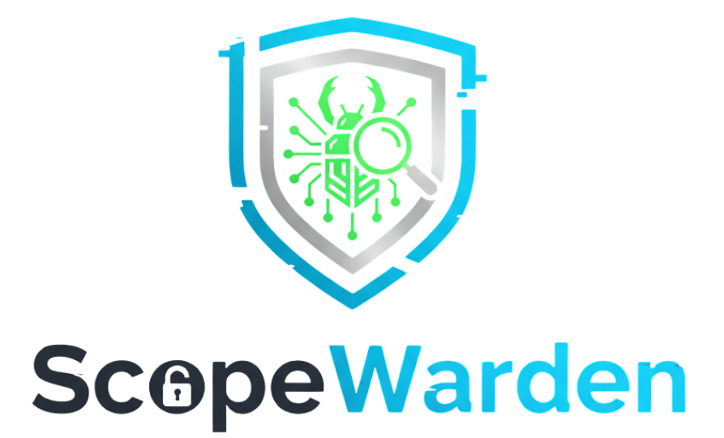

<div align="center">
    
</div>

## 💻 Introduction
ScopeWarden is a self-hostable and configurable automated recon tool. It allows you to automate your workflow without relying on any specific recon tool, and customize the way each scan runs. 

## ✨ Features
- **Run any recon tool:** The yaml configuration file allows you to set any command for the scan to run, and a way to filter results such that only the relevant output gets considered.
- **Run port scans on found assets:** Each found domain from the recon tool can be port scanned, and the configuration allows you to set specific ports to avoid collecting noise. Alternatively, it can run a complete port scan for each found domain.
- **Conditional brute force**: Each tool can be configured to use a brute force tool (e.g. ffuf, gobuster, etc.), which can itself be configured to run based on the technologies found on the domain (e.g. php, wordpress, apache, etc.)
- **Update messages:** Can be configured to send Telegram messages if a new or previously unavailable domain/port becomes available.

## 📦 Setup & Installation
- **Pre-installation Setup**
    ScopeWarden expects some environment variables to be set before installing:
    - **SCOPEWARDEN_CONFIG:** Should be an absolute path to the configuration yaml file.
    - **SCOPEWARDEN_TELEGRAM_API_KEY:** Telegram bot API key. Only necessary if notification is set to true in the configuration file.
    - **SCOPEWARDEN_TELEGRAM_CHAT_ID:** Telegram chat ID. Only necessary if notification is set to true in the configuration file.

- **Telegram Notifications Setup**
    In order to reduce dependencies, ScopeWarden relies on your own Telegram bot and chat ID. To set this up, check the following documentation:
    - **Set up bot token:** https://core.telegram.org/bots/features#botfather
    - **To get your chat ID:** https://gist.github.com/nafiesl/4ad622f344cd1dc3bb1ecbe468ff9f8a#get-chat-id-for-a-private-chat

- **Installing Daeomn/API**
    1. Clone the repository.
    2. In the project directory, run `sudo make daemon`. This builds the binary into `/usr/bin`.
    3. If you want the daemon to run as a service in Linux, run `sudo make attach-daemon`. This moves the `scopewarden-daemon.service` file to `/etc/systemd/system/` and starts the daemon as a service. The daemon can be set to start on boot by running `sudo systemctl enable scopewarden-daemon.service`. 
    4. If the daemon and API were started as a systemd service, check the logs to make sure it is running with: `sudo journalctl -u scopewarden-daemon`.

- **Installing CLI**
    1. Clone the repository
    2. In the project directory, run `sudo make cli`. This builds the binary into `/usr/bin`.
    3. Check installation with `scopewarden -h`.

## 🔧 Configuration
By default, ScopeWarden will not run any tools in the scan. It will continuously loop trying to find the desired configuration yaml file.
The yaml file can contain the folliwng:

This configuration file defines global settings, tools, scanning options, and parsing rules for automated recon.
- **Global**
    - **schedule**: Interval in hours for running scans (e.g., `12` runs every 12 hours).  
    - **notify**: `true` or `false` — enable Telegram notifications.

- **Tools**
    Each tool is defined under the `tools` section with the following fields:
    - **id**: Unique identifier for the tool (e.g., `gau`).  
    - **command**: CLI command to run. It supports the placeholder `<target>` for the target URL.  
    - **verbose**: `true` or `false`. Enables stderr logging for the tool.

    - **Port Scan**
        Optional port scanning configuration:
        - **run**: `true` or `false` — enable port scanning.  
        - **ports**: List of ports to scan. If empty/non-existing, ScopeWarden will run a port scan with no specified ports. (e.g., `21, 22, 53`).  

    - **Brute Force**
        Optional brute force configuration:
        - **run**: `true` or `false` — enable brute force scans.  
        - **command**: The fuzzing command. It supports placeholders`<target>` for the target URL and `<wordlist>` representing the path of the worlist to use.  
        - **regex**: Regex to filter valid results from fuzzing output.
        - **conditions**: Optional list of technology-specific wordlists. Will run the brute force command for **every found domain** if empty or non-existant:
          - **technology**: Target technology to run the scan. This is not case-sensitive. (e.g., `php`, `wordpress`).
          - **wordlist**: Path to the wordlist to use for that technology. Expects absolute path.

    - **Output Parser**
        Defines how the tool output is processed:
        - **type**: Currently only supports `realtime` option (parse output as it is produced).  
        - **regex**: Regular expression to extract relevant information from the tool output.  

- **Example**
    ```
    yaml
    global:
      schedule: 12
      notify: true

    tools:
      - id: gau
        command: 'gau <target>'
        table: 'domain'
        target_table: 'scope'
        verbose: false
        port_scan:
          run: true
          ports:
            - 21
            - 22
            - 53
        brute_force:
          run: true
          command: 'ffuf -u <target>/FUZZ -w <wordlist> -s -rate 5'
          regex: '^[^\/\r\n\\]+\.[^\/\r\n\\]+$'
          conditions:
            - technology: 'php'
              wordlist: '/path/to/php-wordlist.txt'
        parser:
          type: 'realtime'
          regex: '^(https?:\/\/)?([a-zA-Z0-9.-]+\.[a-zA-Z]{2,})(:\d+)?(\/[^\r\n]*)?$'
    ```

## 🎯 CLI Usage
The CLI allows you to add targets and scopes, as well as view the recon results per target in a interactive table.
```
  -iS string
        Comma-separated values for scope. First value should be target name, the second should be a boolean value representing the accept_subdomain field, and the followingvalues will be interpreted as scope URLs (<target_name>,<true/false>,<scope_url>)
  -iT string
        Insert target (<target_name>)
  -s    Show stats
  -t string
        Show target stats based on target name (<target_name>)
```
#### Examples 
- Add target:
    ```
    scopewarden -iT NASA
    ```
- Add scope for target:
    ```
    scopewarden -iS NASA,nasa.gov,something.com,somethingelse.com
    ```
- View table for target:
    ```
    scopewarden -t NASA
    ```

#### Navigating interactive table:
The first table displayed when running -t is the domains table. It shows all domains found when running the configured tools and the status code it received when testing the domain. To navigate the table:
- **[J,K]**: Used for naviating up and down the tables
- **[H,L]**: Used for going back and forward 1 page
- **[P]**: Used to switch to the ports table. It displays the ports found for the selected domain when running the configured port scan and their respective port states. 
- **[A]**: Used to show the results of the brute forced results for the selected domain.
- **[B]**: Used to go back to the main table.

## Contributing:
Anyone is welcomed to point out issues or open PRs for ScopeWarden. I would especially welcome changes or suggestion towards these future plans:
    - **Allow file output parser for tool:** Add parser type 'file' which parses tool output file instead of the real time output in stdout.
